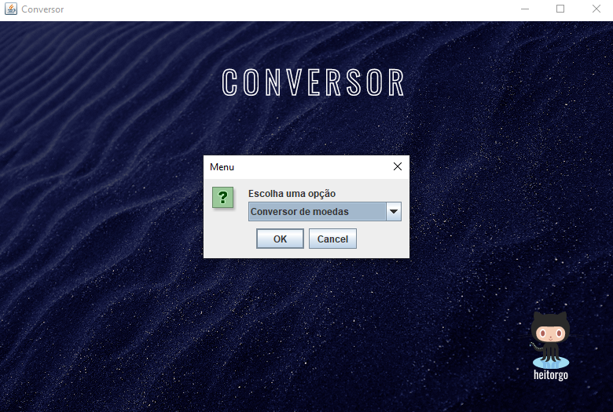

# Conversor de Moedas

## Sistema para realizar conversoes de valores feito em java utilizando a biblioteca swing para interações gráficas com o usuário.

 <a href="#pre-requisitos">Pré-requisitos</a> •
 <a href="#computer-clonando-o-repositório-para-rodareditar-o-código-">Clonando o repositório para rodar/editar o código</a> • 
 <a href="#tecnologias">Tecnologias</a> •
 <a href="#autor">Autor</a>

<h3 align="center">:hammer: Em construção :books:</h3>

## :speech_balloon: Pré-requisitos 

Antes de começar, você vai precisar ter instalado em sua máquina as seguintes ferramentas:
[Git](https://git-scm.com), [Java 15 SE](https://www.oracle.com/java/technologies/javase/jdk15-archive-downloads.html). 
Além disto é bom ter uma IDE para trabalhar com o código como [Eclipse](https://www.eclipse.org/downloads/)

## :computer: Clonando o repositório para rodar/editar o código 🚀

### Clone este repositório
$ git clone https://github.com/heitorgo/ConversorMoedas

### Acesse o Eclipse e abra a pasta para rodar o código e realizar edições 

## Tecnologias

Ferramentas usadas na construção do projeto:

- [Java](https://www.oracle.com/br/java/)
- [javax.swing](https://docs.oracle.com/javase%2F7%2Fdocs%2Fapi%2F%2F/javax/swing/package-summary.html)

## Autor
---

 
<b>Heitor Gonçalves</b>

